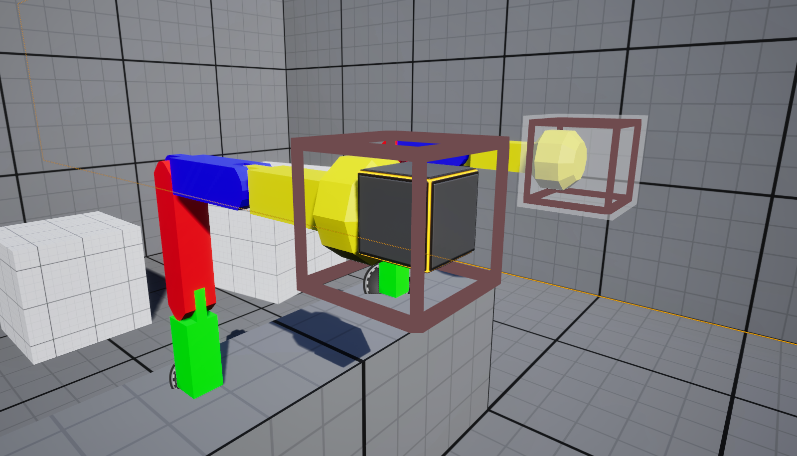
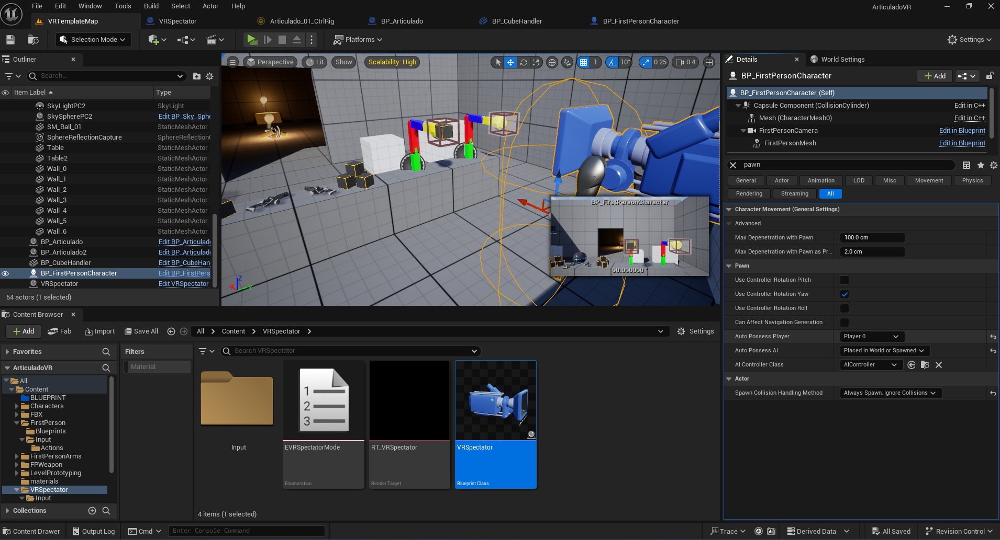

# RIG ARTICULADO CON BLENDER 3D Y UNREAL ENGINE 5.5.1 en VR

un proyecto donde se crea un rig en Blender3D, luego se pasa a un proyecto VR de unreal engine y se le agrega un control rig con IK.
Por último se añade dentro de un BP para que sea manipulado en ejecución.

